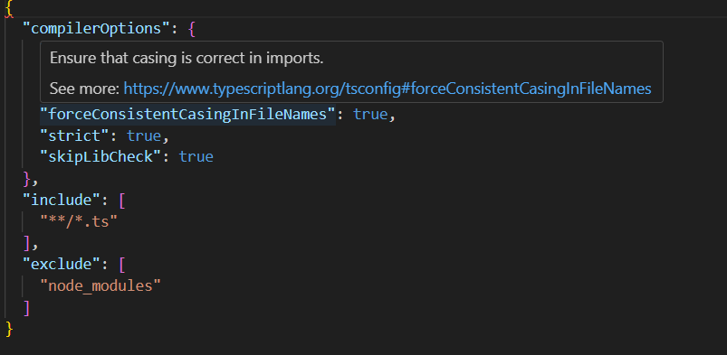

<h1>Coding Standards: From Frustration to Growth</h1>
<h2></h2>The Strictness of Coding Standards is Frustrating?</h2>
When I first worked with TypeScript’s tsconfig.json, I was frustrated by a tiny comma. A red wavy line in VSCode kept warning me, and ESLint even prevented my code from running. I thought, Why does a small, insignificant comma matter so much? It didn’t seem to affect the overall logic, yet the compiler insisted on enforcing this rule. This felt like an unnecessary constraint, as if the linter was picking a fight with me.

<h2>The Purpose Behind the Rules: Consistency and Maintainability</h2>
However, after some reflection, I began to understand why these rules exist. JSON is a strict format where even an extra comma can break the entire file. This doesn’t just affect individual developers but also impacts teamwork. In a collaborative environment, coding standards ensure that every team member can read and correctly parse configuration files, reducing unnecessary debugging time.

<h2>Learning from Mistakes: How Standards Shape Better Habits</h2>
After a week of working with these rules, I started to appreciate their value:

Avoiding Common Mistakes: Issues like an extra comma at the end of a JSON file may seem trivial, but they can lead to unexpected parsing errors.
Improving Readability: A consistent coding style makes the entire codebase easier to navigate and maintain.
Reducing Debugging Time: When the code follows a standard, errors become more predictable and easier to fix.
<h1>Conclusion: Why Follow Coding Standards?</h1>
My initial frustration made me feel that coding standards were limiting my freedom. However, over time, I realized that they are not just "rules" but best practices that help developers write cleaner and more reliable code.

After all, if we can’t even follow basic coding standards, how can we write high-quality software?
