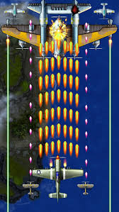

  

For this project, I created a simple aerial combat game using the Pygame library. The player controls an airplane at the bottom of the screen and shoots down enemies or obstacles flying from the top by firing bullets. The background of the game is the sky, and scores and health values are displayed in the upper corner of the screen. There are various enemies in the game, including small spacecraft and asteroids, and the overall style is pixelated, similar to classic arcade games.

