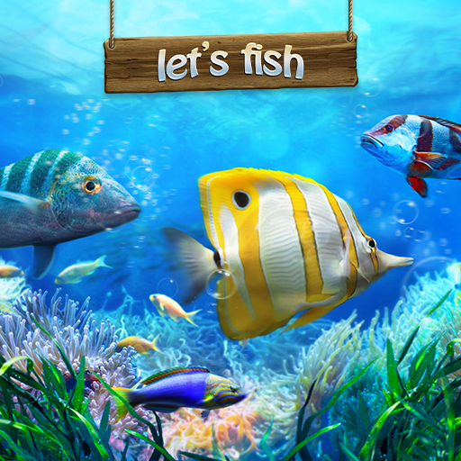

  

This fishing game was the last project developed on the KCC campus using ICS 211 Java. This is a one-of-a-kind game where each player has 12 opportunities to fish sometimes using different methods. Some methods are not allowed during certain seasons and the rules can be printed before each fishing session. Some of the fish caught are too small to fit in the bag, so the decision is made each time whether to bag the fish or let them go. Players who use illegal fishing methods or bag illegal fish will lose the game after 3 times. After 12 times, the total is the longest adventure for one player. There are three people in my team and I am responsible for sorting the two and checking for formatting errors.

